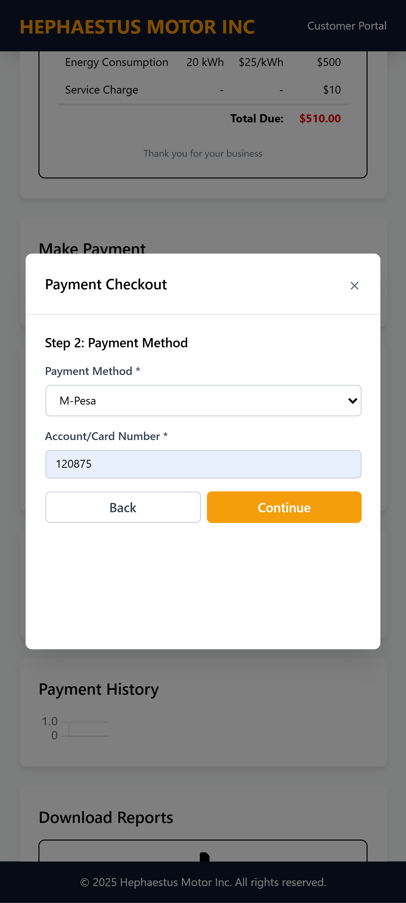

# ⚙️ Hephaestus Utility Billing System

> **"Precision, Power, and Performance in Every Watt."**

A modern, high-performance **utility billing and monitoring platform** built in **Rust**, designed for speed, scalability, real-world applications.  
Powered by **Axum**, **Tera**, and **SeaORM**, the system provides smart metering, billing automation.

---

## 🏢 Virtual Company Information

**Virtual Company:** Hephaestus Motors Inc.  
**Department:** IT and Innovations <br>
**Project Lead:** Simon Wekesa  
**Tech Stack:** Rust · Axum · SeaORM · Tera · PostgreSQL<br> 
**About:** Hephaestus MotorInc is a electricity supply company with 5M+ customers. This digital billing system is aimed to easen up the payment process of the customers plus they have access to their payment and meter history. 

---

## 🚀 Overview

The **Hephaestus Utility Billing System** is a backend service for managing and visualizing power consumption data collected from  meters.

It is designed for:
-  Utility providers (electric)
-  Rust backend developers (Axum)
-  Learners


---

## 🔧 Core Features

| Feature | Description |
|----------|--------------|
| **Automated Billing Engine** | Compute billing from usage data with defined tariffs |
|  **Invoice Management** | Generate and store bills with timestamps and totals |
| **Usage Analytics** | Tera-powered dashboard for consumption visualization |
| **Modular Architecture** | Clean separation between routes, services, and models |

---

## 🧠 System Architecture


---

## 🦀 Tech Stack

| Layer | Technology |
|-------|-------------|
| **Web Framework** | [Axum](https://docs.rs/axum/latest/axum/) |
| **Template Engine** | [Tera](https://tera.netlify.app/docs/) |
| **ORM / Database** | [SeaORM](https://www.sea-ql.org/SeaORM/) + PostgreSQL |
| **Async Runtime** | Tokio |
| **Logging** | Tracing + Tracing Subscriber |
| **Security** | Tower Middleware (Auth / Rate Limiting) |
| **Frontend** | Tera templates |

---

## 📷 Screenshots

### Desktop Screens
<!-- Desktop Screens -->
<div style="display: grid; grid-template-columns: repeat(2, 1fr); gap: 10px;">
  
  
  
  
</div>

<br>

### Mobile Screens
<!-- Mobile Screens -->
<div style="display: grid; grid-template-columns: repeat(2, 1fr); gap: 10px;">
  
  
  
  
  
  
  
  
</div>

---

## ⚙️ Setup and Installation

### 1️⃣ Prerequisites
- Rust (latest stable)
- PostgreSQL
- SQLx CLI (optional, for migrations)
- Sea-ORM

### 2️⃣ Clone Repository
```bash
git https://github.com/Simon0017/Utility-billing-system.git
cd utility-billing-system
cargo install cargo-watch #for automatic server reload when changing code
cargo watch -x 'run'
